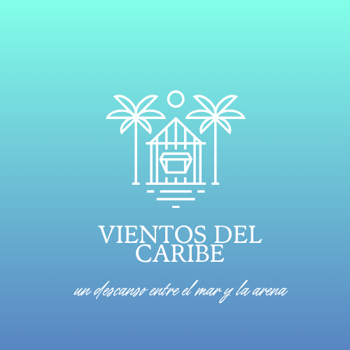

# Trabajo Final (Entrega 1)
## 🌊Resort *Viento del Caribe*🥥

*Un descanso entre el mar y la arena*
---

### Logotipo del Resort
  

---

### 🗺 Layout del Resort   

- Habitaciones: familiares, parejas e individuales.  
- Restaurantes.   
- Zona de piscinas: grandes e infantiles.  
- Bar: todo tipo de bebidas.  
- Zonas de entretimiento: espacios deportivos, gimnasio y spa. 
- Más espacios como: playas y hermosos jardines.
  
![Layout].(Layout.png)

---

### 📖 Descripción General del Proyecto  
Se trata de pryoecto mediante el cual, presentaremos nuestras habilidades para planear y deiseñar estrategicamente la distibución y administración de un resort.
Aquí, adjuntamos imagenes e información que permite tener una idea de como será nuestro resort.

---

###  Equipo Desarrollador  

  *Integrantes*
- Maylin Vnessa Martínez Arrieta
- Vanesa Lucía Bernal Ruiz

Ambas pertenecemos al programa de *Ingeniería Industrial*.  

###  *Habilidades y Fortalezas*
- Maylin Vanessa Martinez Arrieta: buen manejo de finanzas y administración. 
- Vanesa Lucía Bernal Ruiz: conocimiento de progrmación.
  
### *Responsabilidades en el Proyecto*
- Maylin Vanessa Martinez Arrieta: encargada de diseñar el layout, logo  organizar la información en GitHub.
- Vanessa Lucía Bernal Ruiz: encargada de crear el pesseudocodigo e identificar las estructuras de datos.
   
### *Líder del Equipo*
Vanesa Lucía Bernal Ruiz.

